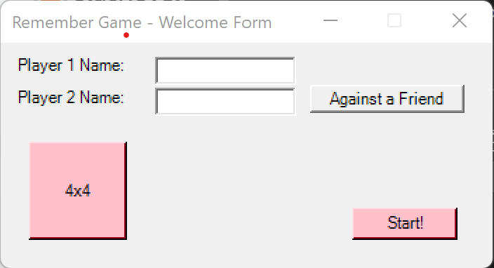
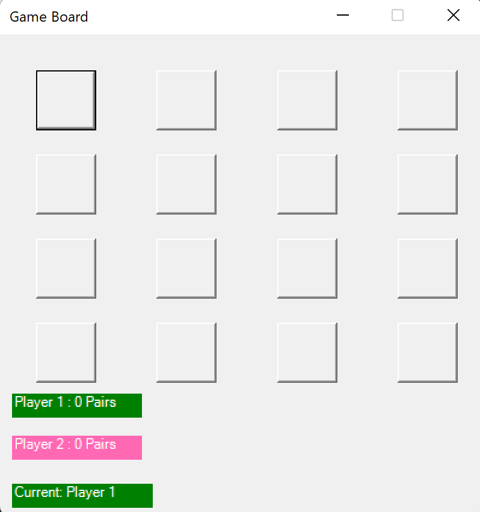

# CSharp22Ex05 - academy c# assignment

in this assignment we asked to build a WinFoems memory game. the UI layer supposed to be seperated from the logic 

this assingmrnt goal is to implement  use of UI , Object Oriented Programing,Delegates.

